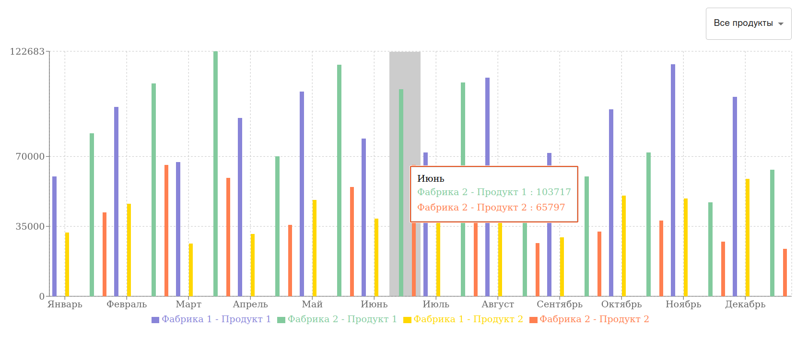
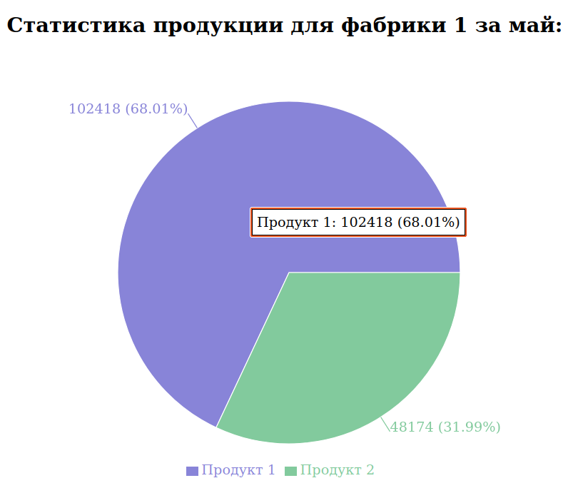

<h1 align="center">УГМК Тестовое Приложение</h1>

Анализ данных

 

Это проект, разработанный с использованием React, который включает в себя приложение и сервер. Приложение отображает график производства двух типов продукции на двух фабриках по месяцам с возможностью фильтрации и отображает круговую диаграмму суммарного производства по каждому типу продукции на странице деталей.

## Установка и запуск

### Установка зависимостей

Для установки всех необходимых зависимостей выполните следующую команду:

`npm install`

### Запуск приложения

Чтобы запустить приложение на локальной машине, выполните следующую команду:

`npm run start`

Приложение будет доступно по адресу: localhost:3000

## Docker

### Создание Docker образа

Для создания Docker образа с именем ugmk_test_app выполните следующую команду:

`npm run dockerize`

### Запуск контейнера
Для запуска контейнера с именем ugmk_test_app выполните следующую команду:

`npm run start-container`

Приложение будет доступно по адресу: localhost:3000

После завершения работы приложения контейнер будет автоматически удалён.

## Сервер

Сервер предоставляет два эндпоинта:
- `/products` - возвращает информацию о типах продукции и фабриках по месяцам.
- `/details/:factoryId/:month` - возвращает сумму всех произведённых товаров одной фабрикой за определённый месяц.

## Функциональность приложения

- График, отражающий помесячное количество производимой продукции двух типов двух фабрик.
- Возможность фильтрации по типу продукции (все, продукт 1, продукт 2).
- При нажатии на определённую колонку графика открывается страница с круговой диаграммой, показывающей суммарное производство каждого типа продуктов для выбранной фабрики.